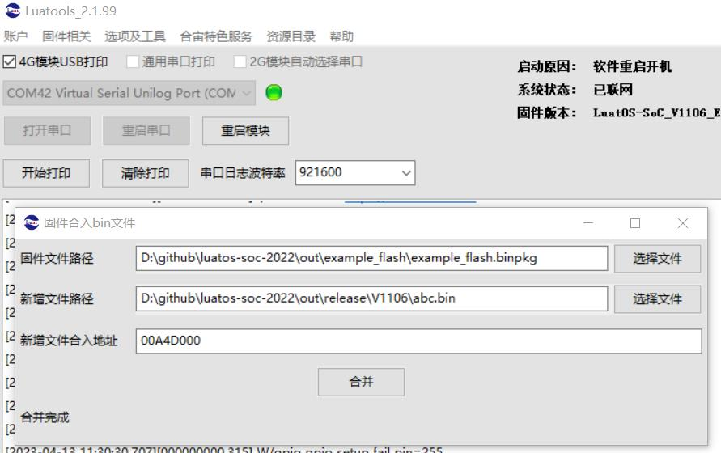

# 说明

* 片上flash读写演示

## 量产刷机时往指定flash地址刷入数据的说明

提醒:
1. 支持刷入多个区域, 但需要多次合成
2. 使用普通的Multiownload

使用场景:
1. 刷入自定义的文件系统镜像
2. 刷入TTS数据到指定位置

## 操作步骤, 以单个区域为例

### 第一步, 项目中空出对应的空间

项目内xmake.lua配置宏定义即可：

```lua
    -- 程序区缩小到1b3000，剩余2b3000 - 1b3000 = 100000 1MB空间为用户区
    add_defines("AP_FLASH_LOAD_SIZE=0x1b3000",{public = true})
    add_defines("AP_PKGIMG_LIMIT_SIZE=0x1b3000",{public = true})
```

使用全部的空间为程序区，填写一个比0x2b3000小的值，缩小程序区，留下的是用户区。demo是0x1b3000，留出了1MB空间为用户区

### 第二步, 确定刷入的地址/大小/名称

示例:

地址: 0x00A4D000
文件: abc.bin  无格式要求,可以是任意内容

### 第三步, 打开LuaTools进行合并

主界面, 选项及工具, 固件合并文件工具



按图选择 binpkg文件, 待并入的文件, 填入地址, 点击合成

完成后, 在binpkg所在目录下, 会生成新的binpkg, 使用该binpkg刷机即可, 兼容普通MulitDownload程序

### 如需添加更多片段

重复1/2步骤, 但第二步的时候要选新生成的binpkg

注意: 并入地址要升序, 否则不能成功
